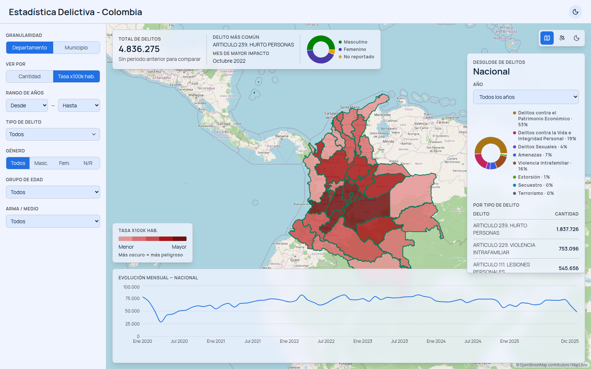
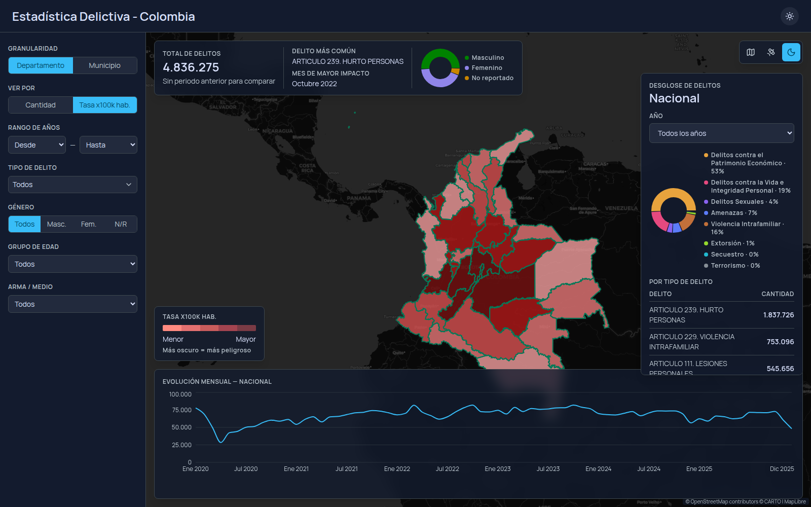

# Estadística Delictiva — Colombia

Dashboard geoespacial de alto rendimiento para explorar más de 4.8 millones de registros de delitos en Colombia (2020–2025), cruzados con la topología oficial de sus 1.122 municipios y las proyecciones de población del DANE. Proyecto de portafolio enfocado en arquitectura limpia, performance (TTV < 2s, 60 FPS, API < 300ms) y viabilidad en infraestructura *free-tier*.



<details>
<summary>Ver en tema oscuro</summary>



</details>

## Funcionalidades

*   **Choropleth por cantidad absoluta o tasa per cápita** — alterna entre el conteo bruto de delitos y la tasa normalizada por población (por cada 100.000 habitantes, usando proyecciones oficiales del DANE), con una leyenda fija que indica la dirección de la escala ("más oscuro = más peligroso") en ambos temas.
*   **Dos niveles de granularidad** (Departamento / Municipio) con recoloreo instantáneo vía `feature-state` de MapLibre — nunca vuelve a pedir ni re-renderizar geometría al cambiar de filtro.
*   **Filtros cruzados y dinámicos**: rango de años, tipo de delito (multiselección), género, grupo de edad, arma/medio — todos combinables, actualizando mapa y gráficos en vivo.
*   **Panel de KPIs**: total de delitos, variación porcentual vs. el periodo anterior (con manejo explícito del caso sin periodo previo comparable), delito más común, mes de mayor impacto, distribución por género.
*   **Evolución temporal**: línea mensual nacional por defecto, barras anuales al aislar una región, y comparación paralela de dos regiones superpuestas en el mismo gráfico.
*   **Desglose de delitos por tipo**: tabla completa ordenable + gráfica de pastel agrupada en 8 categorías penales, a nivel nacional o de una región específica, filtrable por año.
*   **3 mapas base intercambiables** (OpenStreetMap, Satelital, Oscuro) ligados al tema activo, con atribución legal visible.
*   **Tema claro/oscuro** con tokens de diseño reconciliados y validados para accesibilidad (contraste WCAG, daltonismo).

## Stack

| Capa | Tecnología |
|---|---|
| Base de datos | PostgreSQL + PostGIS |
| Backend | Rust (Axum + SQLx) |
| Frontend | React (Vite) + MapLibre GL JS + Zustand |
| Diseño | Sistema de diseño propio (Light/Dark) — [Figma](https://www.figma.com/design/NJXIriyDT674hHetseeX0B/estadistica_delicitva) |

## Por qué este stack (decisiones documentadas)

Este proyecto no solo implementa un dashboard — documenta el razonamiento detrás de cada decisión arquitectónica relevante:

*   **[ADR 0001](docs/adr/0001-postgis-vs-geoserver.md):** PostGIS + Rust en vez de un servidor GIS pesado (GeoServer), para minimizar costo de infraestructura.
*   **[ADR 0002](docs/adr/0002-separacion-geometria-estadisticas.md):** la geometría cartográfica (estática) se sirve desacoplada de las estadísticas delictivas (dinámicas) en endpoints separados, para maximizar cacheo HTTP/CDN y mantener las interacciones de filtrado livianas.
*   **[Migración correctiva de datos](scripts/migrations/0001_fix_codigo_dane_y_homologacion.sql):** una auditoría manual encontró que el cruce por Código DANE entre la tabla de hechos y la geometría municipal producía 0% de coincidencias — el proceso, causa raíz y corrección (99.9994% de coincidencia final) están documentados en el script y en `docs/plans/01-plan-estandarizacion-migracion.md`.
*   **[Sistema de diseño](docs/design/00-design-system.md):** tokens Light/Dark reconciliados (roles semánticos, rampa de choropleth validada con verificación programática de accesibilidad para daltonismo), no solo una paleta de colores.

## Estructura del repositorio

```
.
├── antigravity.md      # Memoria de agente / centro de comando del proyecto — leer primero
├── docs/               # Arquitectura, ADRs, requerimientos, historias de usuario, planes, diseño
├── scripts/            # ETL: estandarización y migración de los datos crudos a PostgreSQL
├── backend/            # API en Rust (Axum + SQLx) — Clean Architecture (ver docs/plans/02-...)
└── frontend/           # Cliente en React + MapLibre GL JS — estructura por features
```

`Data/` (los Excel crudos de delitos y población, y el shapefile de municipios) no se versiona — ver `docs/plans/01-plan-estandarizacion-migracion.md` y `docs/plans/04-plan-desarrollo-funcionalidades-v2.md` para el origen de los datos (Policía Nacional de Colombia y DANE, ambos datos abiertos) y cómo regenerarlos.

## Desarrollo local

Guía completa (prerrequisitos, base de datos, backend, frontend) en [`docs/desarrollo-local.md`](docs/desarrollo-local.md). Con todo ya configurado, el día a día es:

```bash
cd backend && cargo run      # http://localhost:3000
cd frontend && npm run dev   # http://localhost:5173
```

## Tests

```bash
cd backend && cargo test     # 107 tests (unitarios + integración contra Postgres real)
cd frontend && npm test      # 84 tests (Vitest + Testing Library)
```

Ambas capas se desarrollaron con TDD estricto (red → green → refactor) — ver la sección "Metodología" de cada README de capa.

## Documentación

Todo el conocimiento del producto vive en `docs/` y se indexa desde [`antigravity.md`](antigravity.md), el punto de entrada obligatorio del proyecto (para humanos y para cualquier agente de IA que lo retome):

*   **Arquitectura:** [Visión](docs/architecture/00-proyecto.md) · [Sistema](docs/architecture/01-arquitectura.md) · [Contratos de API](docs/architecture/02-api-contracts.md)
*   **Producto:** [Requerimientos](docs/requirements/requerimientos.md) · [Reglas de negocio](docs/requirements/reglas-negocio.md) · [Historias de usuario](docs/requirements/historias-usuario.md)
*   **Diseño:** [Sistema de diseño](docs/design/00-design-system.md)
*   **Roadmap:** [Plan Backend](docs/plans/02-plan-desarrollo-backend.md) · [Plan Frontend](docs/plans/03-plan-desarrollo-frontend.md) · [Plan Funcionalidades v2](docs/plans/04-plan-desarrollo-funcionalidades-v2.md) (tasa per cápita, desglose de delitos, leyenda del mapa)
*   **Seguimiento:** [Backlog](BACKLOG.md) — qué se hizo, qué sigue, decisiones pendientes y deuda técnica, actualizado con cada hito.

## Estado

Backend y frontend completos de punta a punta, incluyendo las 3 funcionalidades del plan v2 (tasa per cápita, desglose de delitos por tipo, leyenda del mapa) — todo verificado con datos reales end-to-end en ambos temas. Ver el tracker en [`antigravity.md`](antigravity.md) y el detalle granular en [`BACKLOG.md`](BACKLOG.md). Queda pendiente el despliegue final (Fase 5).

## Licencia

[MIT](LICENSE)
